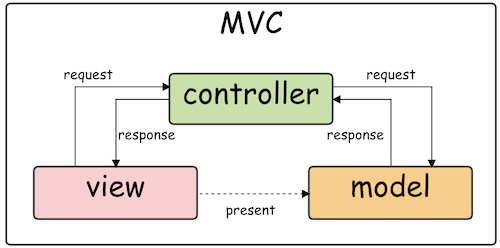
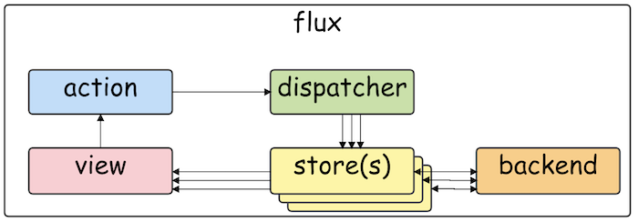

# 2. webアプリのしくみ

- *Up: [目次](../index.md)*
- *Back: [1. はじめに](./01_intro.md)*
- *Next: [3. reduxの特徴](./03_feature.md)*

## 3層アーキテクチャー

webアプリは3層アーキテクチャーで理解することができる。

|層の名前|役割|サービスの名前|Ruby on Rails|状態|
|-|-|-|-|-|
|プレゼンテーション層|表示|webクライアント|View|あり|
|アプリケーション層|制御|webサーバー|Controller|なし|
|データ層|記憶|データベース|Model|あり|

フロントエンドの技術は `webサーバー <-> webクライアント` 間を問題にする。

一般的に、webクライアントはデータベースとは異なる、一時的な表示状態を持つ。

フロントエンドの状態管理ライブラリは、この表示状態を一定のルールで管理する。

- SSR, SSG: サーバー側でHTMLを生成する
- SPA: クライアント側でHTMLを生成する

## webアプリの設計

3層アーキテクチャーを具体的に設計するために、いくつかの設計が提案された。
- どういう構成要素に分けるか？
- 構成要素の間でどのようにデータが流れるか？

### MVC

#### 何をした？

- 3層アーキテクチャーを素直に設計した

#### 構成要素

- Model: データベース
- Controller: HTTPサーバー
- View: webアプリ

#### データの流れ

- リクエスト
  - View => Controller => Model
- レスポンス
  - Model => Controller => View
- どうなるか？
  - View は Model を表示している

#### 問題点

- 依存関係が複雑
  - 両方向の矢印がある
- 変更が難しい
  - 3つの要素を「同時に」「正しく」修正する方法が決まっていない
- 状態管理が曖昧
  - 最新の表示になるか？
  - 最新の表示にならない場合、理由を理解できるか？

### flux

#### 何をした？

- Viewを拡張した
  - webアプリの見た目と状態管理を分離した
  - 依存関係を1方向に制限した

#### 構成要素

- Store(s): アプリの状態を保持するオブジェクト(1つ以上)
- View: webアプリの見た目
- Action: webアプリから発行するイベント
- Dispatcher: Action => Store への変換を定義する関数

#### データの流れ

- リクエスト
  - View => Action => Backend
- レスポンス
  - Backend => Action => Dispatcher => Store => View
- どうなるか？
  - View は Store をsubscribeしている（直接Backendではない）

### redux

#### 何をした？

- Storesを1つだけにした
- Dispatcherを純関数(Reducer)にした

#### 構成要素

- Store: アプリの状態を保持するオブジェクト(1つだけ)
- View: webアプリの見た目
- Action: webアプリから発行するイベント
- Reducer: Action => Store への変換を定義する**純**関数

#### データの流れ

- リクエスト
  - View => Action => Backend
- レスポンス
  - Backend => Action => Reducer => Store => View
- どうなるか？
  - View は Store をsubscribeしている（直接Backendではない）

